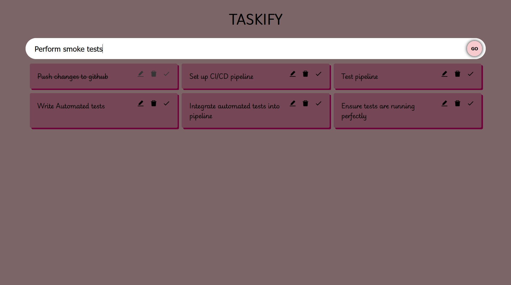

# TASKIFY - Todo App

A simple, intuitive Todo application built with React and TypeScript. This app allows users to add, delete, and mark tasks as complete with a clean user interface.

## Features

- **Add, delete, and mark tasks as complete**: Manage your daily tasks easily.
- **Update tasks**: Edit tasks after adding them to keep your list accurate and up to date.
- **Disabled action buttons for completed tasks**: Action buttons are automatically disabled once a task is marked complete to prevent accidental modifications.
- **Custom styling**: Unique styling for a better user experience.

## Tech Stack

- **React**: Component-based library for building the user interface.
- **TypeScript**: Ensures type safety and improved code readability.
- **CSS**: Custom styles for the application's look and feel.

## Setup and Installation

1. **Clone the repository**:
   ```bash
   git clone https://github.com/Pratik-Dash/TypeScript-Todo-App.git
   cd TypeScript-Todo-App
   ```

2. **Install dependencies**:
   ```bash
   npm install
   ```

3. **Run the app**:
   ```bash
   npm run dev
   ```
   The app will be available at `http://localhost:5173`.

## Usage

1. **Add a new task** by typing in the input field and pressing "Add".
2. **Complete a task** by clicking the "Complete" button. Once a task is marked as complete, action buttons will be disabled.
3. **Delete a task** by pressing the "Delete" button.

## Original Modifications

- **Disable Action buttons**: Action buttons are disabled for completed tasks to avoid accidental changes.
- **Styling**: Unique styling implemented to improve user interface.

## Credits

This project was initially inspired by the [FreeCodeCamp tutorial on YouTube](https://www.youtube.com/), with additional modifications for improved functionality and style.

## Screenshots





